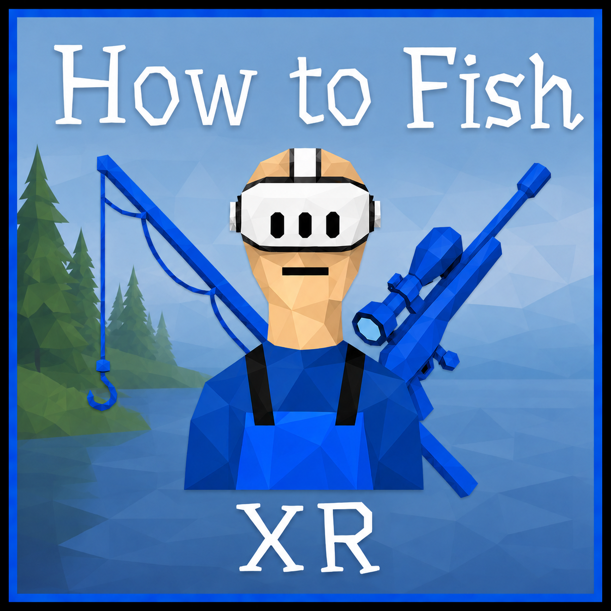
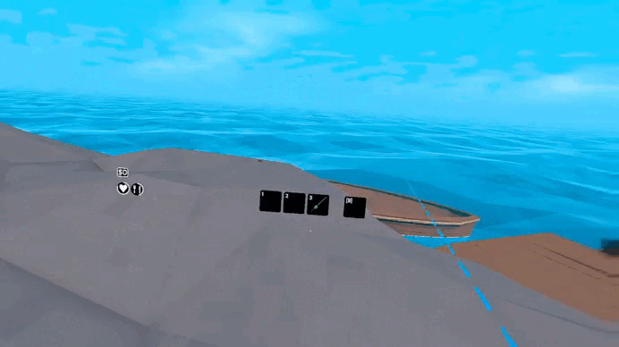
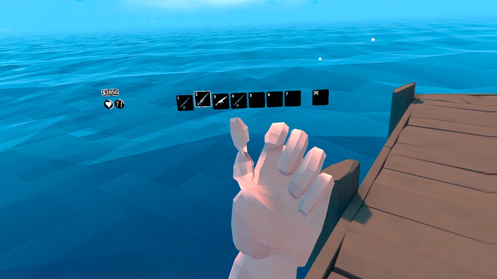

<h1 align="center">HowToFishXR</h1>

<p align="center"><strong>by J_axon</strong></p>

<p align="center">
  
</p>

<p align="center">
  <a href="https://thunderstore.io/c/how-to-fish/p/J_axon/HowToFishXR/"></a>
  <a href="https://github.com/Ghostx10742/HowToFishXR/releases/latest"></a>
  <a href="https://thunderstore.io/c/how-to-fish/p/J_axon/HowToFishXR/"></a>
  <a href="https://github.com/Ghostx10742/HowToFishXR/releases/latest"></a>
  <br>
  <a href="https://github.com/Ghostx10742/HowToFishXR/actions/workflows/build-release.yml"></a>
  <a href="https://github.com/Ghostx10742/HowToFishXR/actions/workflows/build-debug.yml"></a>
</p>

HowToFishXR is a free, open-source [BepInEx](https://thunderstore.io/c/how-to-fish/p/BepInEx/BepInExPack/) mod that brings full 6DoF PCVR to **How to Fish**. It adds tracked hands, hand-aimed melee combat, motion-controlled tools, physical fishing and reeling, one- and two-handed gun handling, roomscale movement, full-body IK, VR-native UI, multiplayer pose syncing, and the visual feedback needed to play the complete game inside a headset.

> **Credit required.** You are free to study, modify, and redistribute this project under the Apache License 2.0. If you reuse its code, you must preserve the license and NOTICE attribution, clearly credit **J_axon** as the creator, and link to [HowToFishXR](https://github.com/Ghostx10742/HowToFishXR). See [LICENSE](LICENSE) and [NOTICE](NOTICE).

## Support the project

HowToFishXR is completely free, and donating is entirely optional. Nothing is locked behind payment and you never need to donate to download, use, or modify the mod. If you enjoy it and would like to support future work, you can help on Ko-fi:

### [ko-fi.com/j_axon](https://ko-fi.com/j_axon)

## Controls

Button names use the familiar Meta/PICO layout. Valve Index, Vive, WMR, and other OpenXR controllers use the equivalent primary and secondary buttons for each hand.

| Input | Action |
|---|---|
| Left stick | Move; while driving, steer left/right and control throttle with up/down |
| Left stick click | Sprint |
| Right stick left/right | Snap turn or smooth turn |
| Right stick up/down | Previous/next inventory slot |
| Right stick click | Crouch |
| Right trigger | Fire, use, punch, or hold to reel in; click/drag menus with the right-hand laser |
| Left trigger | Secondary use; hold and release to cast or reel out |
| Right grip | Pick up, interact, and enter/exit the boat |
| Left grip—press once | **F / Inspect** the held item |
| Left grip near a gun | Grab the foregrip for two-handed aiming |
| Left grip near a fishing reel | Latch onto the reel for physical reeling |
| Left grip near a non-tool item/body | Visually latch the second hand; the main hand keeps control |
| A / right primary | Jump |
| B / right secondary | Switch bait |
| Hold left grip + B | Drop; hold B to charge and release to throw |
| X / left primary | Reload a gun |
| Y / left secondary | Pause/unpause |
| F1 or both stick clicks | Open/close VR Settings while the main or pause menu is open |
| F2 | Recenter forward direction |
| F3 | Start standing-height and body calibration |

Only the right-hand laser controls menus. Gun aiming is physical—there is no separate ADS button—and push-to-talk is intentionally not bound by the mod. Throwing uses the direction and motion of your right hand for aiming. Empty-hand punches, brass knuckles, and the knife also aim along the right hand, with extra VR reach and small-target assistance for low creatures. The segmented melee guide is enabled by default and can be switched off in **VR Settings**. Pressing the trigger briefly shows it: red during/recent input, then light blue before hiding after five seconds.

## Requirements and headset support

- **How to Fish** on Windows/Steam.
- [BepInEx 5](https://thunderstore.io/c/how-to-fish/p/BepInEx/BepInExPack/) (`BepInEx-BepInExPack-5.4.2305`).
- A PCVR headset and an active OpenXR runtime such as SteamVR, Meta/Oculus, PICO Connect, or Virtual Desktop.

HowToFishXR uses OpenXR instead of locking itself to one brand. Its included interaction profiles cover Meta Quest 1, 2, 3 and 3S over Link/Air Link/SteamVR/Virtual Desktop, Rift and Rift S, Valve Index, HTC Vive, Windows Mixed Reality, HP Reverb G2, Meta Touch Pro, and Khronos-compatible controllers. PICO PCVR controllers use Unity's common OpenXR controller mappings. This is a Windows PCVR mod, not a standalone Android/Quest APK.

## Multiplayer

HowToFishXR provides full multiplayer pose syncing between VR and flat-screen players who have the mod installed. Modded players can see VR head, hand, body, tool, and fishing poses. Some VR-player movements or interactions may still look inaccurate or bugged to other players; those remaining sync issues are actively being patched.

## Fishing in VR

### Casting

Hold the **left trigger** to prepare the cast. Swing the rod from the side like a baseball bat, but do not swing extremely fast. Release the trigger a little earlier than you might expect as the rod comes forward. A controlled side swing and an early release produce a much more reliable cast than a hard wrist flick.

<p align="center">
  
</p>

### Physical reeling

Move your support hand to the reel and hold its grip button. Your visible hand latches onto the crank while the rod remains driven by your main hand. Rotate your support hand around the reel to crank it physically; either direction is accepted. Grabbing the reel after a cast automatically changes the rod from reeling out to reeling in, and faster cranking uses the game's faster reel behavior. You can switch freely between physical cranking and holding the right trigger to reel.

The rod, bait, bend, line, audio, caught-item behavior, and game-authored reel speeds remain part of the original fishing system—the mod changes how you physically control them.

## Fists, brass knuckles, and knife

Empty-hand punches, brass-knuckle attacks, and knife strikes aim from the calibrated **right hand**, just like throwing. Press the right trigger to attack along the controller's corrected forward direction. VR melee uses a 3-meter minimum targeting range so you can point down and hit crabs, pond creatures, and other small targets from a natural standing position. A focused aim assist follows the creature under your hand line while walls and other real obstructions still block the attack.

The segmented melee guide is enabled by default and can be toggled with **Melee Aim Guide** in VR Settings. Pressing the trigger shows the actual attack path in red; it changes to light blue after the input and hides five seconds after the last press. It appears only during gameplay with empty fists, brass knuckles, or the knife—not while using menus or other tools.

The knife stays locked to the authored right-hand grip while its flat-screen sway and attack-lunge animations are suppressed, so the hand remains controller-driven throughout the strike.

<p align="center">
  
</p>

## Gun handling

Guns sit on the calibrated main-hand grip and fire from their real muzzle. Bring your support hand near the weapon's authored foregrip and hold grip to enter two-handed handling. Both controller positions influence the weapon's direction, the main hand remains the rear pivot, and the support hand steadies and steers the barrel. Release support grip to return to one-handed handling.

<p align="center">
  
</p>

Two-handed handling activates the game's aiming accuracy without forcing a flat-screen FOV zoom. Scopes and sights remain physical objects on the gun; the flat 2D sniper overlay is disabled, and scoped shots follow the real muzzle. Native recoil still appears without moving the grip away from your hands, and the flat-screen sprint tuck animation is removed from held VR items.

### A note about the support-hand finger

At some angles the finger on the left/support hand can look twisted. That shape comes from the game's original mirrored hand/finger geometry. It is present in the flat-screen model too, but VR lets you inspect it much more closely; it is not controller tracking drift or a broken two-hand grip.

<p align="center">
  
</p>

## Features

- Full stereoscopic OpenXR tracking, roomscale movement, physical crouching, calibration, turning options, and a clean desktop mirror.
- Full-body IK or Hands Only mode, with multiplayer VR pose syncing and body handling for boats, death, respawning, and scene changes.
- Physical casting/reeling, one- and two-handed guns, hand-aimed fists/knuckles/knife combat, throwing, physics-aware items, dead bodies, and TNT.
- VR-converted HUD, menus, dialogue, character customization, world markers, death/underwater/damage effects, scopes, and UI blur.
- Right-hand menu clicking/dragging plus an automatic in-world keyboard for names and other typing events.
- VR or flat-screen startup without uninstalling the mod.

### VR keyboard

Selecting a writable text field automatically opens the in-world keyboard in the correct menu space. While it is active, the normal menu laser is hidden and the right controller becomes a keyboard-only pointer. The keyboard follows the moving main-menu boat, types directly into the selected field, and includes a dedicated **Close** button that safely returns control to the menu.

## VR Settings menu

Open the native-styled **VR Settings** page from the main menu or pause menu. You can also press **F1** or click both thumbsticks while either menu is visible.

| Setting | What it changes |
|---|---|
| Body | Full Body IK or Hands Only |
| Turning | None, Snap, or Smooth turning |
| Snap Angle | Degrees rotated per snap turn |
| Smooth Speed | Smooth-turn degrees per second |
| Melee Aim Guide | Toggle the temporary fists/knuckles/knife aiming guide |
| Roomscale Movement | Physical walking and crouching move the game body |
| Sprint Mode | Hold or Toggle |
| Crouch Mode | Hold or Toggle |
| HUD Scale | Size of the VR HUD |
| Death View | First-person ragdoll view or head-tracked third-person view |
| Calibrate | Starts the guided standing T-pose calibration |

Dominant-hand, HUD-distance, VR post-processing, hand position/rotation, height-offset, and motion-vignette controls are intentionally not present. The primary hand is permanently right, HUD distance and hand calibration use their tested values, the tested VR visual-effects path is always used, player height uses the game's native height, and there is no forced motion vignette.

### Advanced BepInEx settings

The generated `BepInEx/config/com.jaxon.howtofishvr.cfg` also exposes advanced values:

- **Disable VR** for persistent flat-screen startup; `--disable-vr` is the one-launch Steam option.
- **World Scale**.
- **Recenter** and **Calibrate Height** keyboard bindings, plus saved calibration values.
- **Turn Deadzone** and **Movement Deadzone**.
- **Head Relative Movement**; when disabled, movement follows the support-hand direction.
- **Boat Steer Sensitivity**.
- **HUD Follows Head** and **HUD Smoothing**.
- **Grip Threshold**.
- **Real UI Blur** toggle for the native frosted effect/fallback.
- **Body Offset** for advanced body-position correction.
- **VR Pose Sync** and **VR Pose Sync Rate** from 5–60 Hz.

## Launching in VR or flat screen

VR is the default. Start your chosen OpenXR runtime before launching **How to Fish**, then start the game normally through Steam.

For a one-time flat-screen launch, add this Steam launch option:

```text
--disable-vr
```

For persistent flat-screen mode, set `Disable VR = true` in `BepInEx/config/com.jaxon.howtofishvr.cfg`. The mod can remain installed, and its multiplayer receive side can still display synced VR players on a modded flat-screen client.

## Installation

The GitHub package will be attached to the [GitHub Releases](https://github.com/Ghostx10742/HowToFishXR/releases) page. It contains `README.md`, `NOTICE`, and the mod's `BepInEx/plugins` and `BepInEx/patchers` folders. **BepInEx is required and is not bundled.** Thunderstore uses a separate package with its own manifest, icon, README, and declared BepInEx dependency.

1. Install [BepInEx 5](https://thunderstore.io/c/how-to-fish/p/BepInEx/BepInExPack/).
2. Download and unzip the latest HowToFishXR release archive.
3. Copy the archive's `BepInEx` folder into the folder containing `How to Fish.exe`, then allow the folders to merge.
4. Start an OpenXR runtime, then launch the game through Steam.

Developers who want to compile the source should follow the build-from-source section below and [BUILDING.md](BUILDING.md). Game assemblies, logs, dumps, backups, and decompiled game files are deliberately not included in this repository.

## Compatibility

HowToFishXR changes the camera, input, player-body presentation, item handling, and game UI. Mods that patch the same systems may conflict. Multiplayer gameplay remains compatible with vanilla lobbies, but full remote VR body/hand posing requires a modded host and modded receiving clients.

If a game update changes the relevant methods or assets, the mod may require an update. Please include the game version, headset/runtime, and clear reproduction steps in bug reports—never upload personal or unrelated logs without reviewing them first.

## Build from source

Building requires Windows, PowerShell, the .NET 8 SDK, an installed copy of **How to Fish**, BepInEx 5, and the matching Unity/OpenXR dependencies. Proprietary game assemblies are not distributed in this repository.

1. Clone the repository and enter it:

   ```powershell
   git clone https://github.com/Ghostx10742/HowToFishXR.git
   Set-Location .\HowToFishXR
   ```

2. Put your legally obtained compile-time dependencies in `lib/` as described in [BUILDING.md](BUILDING.md), then generate the publicized game references:

   ```powershell
   .\tools\publicize.ps1
   ```

3. Build both projects:

   ```powershell
   dotnet build .\src\Preload\HowToFishVR.Preload.csproj -c Release
   dotnet build .\src\HowToFishVR\HowToFishVR.csproj -c Release
   ```

4. After supplying the local packaging dependencies described in [BUILDING.md](BUILDING.md), assemble the install overlay:

   ```powershell
   .\tools\package.ps1
   ```

The finished overlay is written to `dist/HowToFishXR/`. See [CONTRIBUTING.md](CONTRIBUTING.md) before opening a pull request. Game assemblies, generated references, logs, dumps, and backups must never be committed.

To build the upload-ready GitHub release ZIP without bundling BepInEx, run:

```powershell
.\tools\package-github-release.ps1
```

The archive is written to `release/HowToFishXR-v1.3.0.zip` and contains only `README.md`, `NOTICE`, and the mod's `BepInEx` folder.

To build the Thunderstore upload package, run:

```powershell
.\tools\package-thunderstore.ps1
```

The Thunderstore archive uses the version from `thunderstore/manifest.json`; the current output is `release/HowToFishXR-Thunderstore-v1.3.0.zip`.

## Open source and attribution

HowToFishXR is open source under the **Apache License 2.0**. You may inspect, modify, and redistribute the code under that license. When you reuse or distribute this work, keep the Apache license and the project's NOTICE attribution with it, clearly credit **J_axon** as the original creator, mark your changes, and link back to [HowToFishXR](https://github.com/Ghostx10742/HowToFishXR). The game and all original game assets remain the property of their respective owners.

## Credits

- Created and directed by **J_axon**.
- Testers: **Aeolian**, **Feesh**, **mrbub**, **Nuggies**, **supersaiyanslyr**, **VernalWitch**, and **Wake**.

## AI disclosure

AI was used during the development of this project, mainly for revisions, inquiries, and things I just did not know. This does not mean the mod was fully AI-made, but rather that AI was used as part of the development process. I wanted to disclose this for people who may have a problem with AI being involved and may not want anything to do with it. Even though I disagree with your view on AI, I still respect your opinion on the subject.
